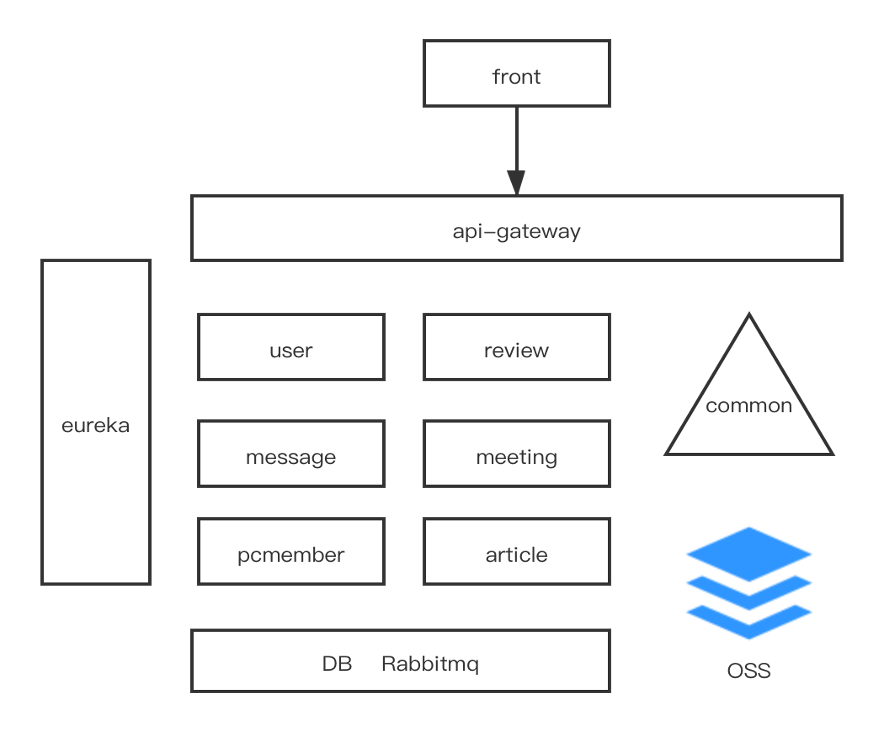

# 架构文档
## 系统架构图

- 10个服务
6个后端基础服务
1个公共本地服务
前端
zuul网关
eureka服务注册中心

- 1个云存储服务
阿里云OSS

- 1个消息中间件
Rabbitmq

## service

系统核心业务架构实现了微服务化，共有article-service、pcmember-service、  
review-service、meeting-service、user-service、message-service等6个服务。  
